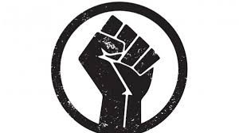
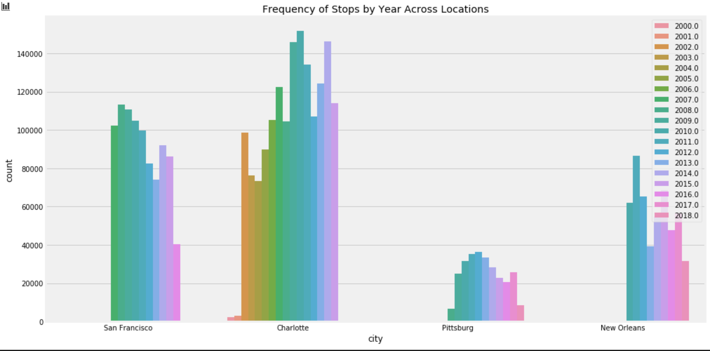
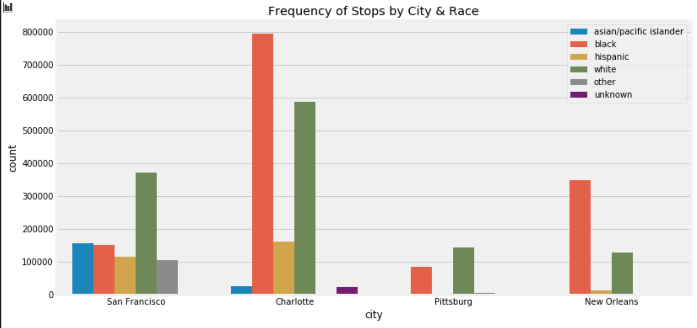
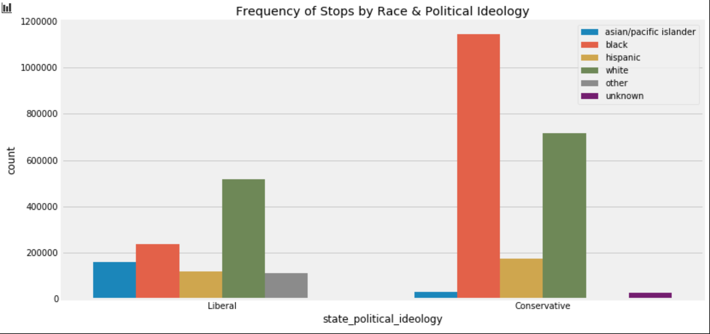
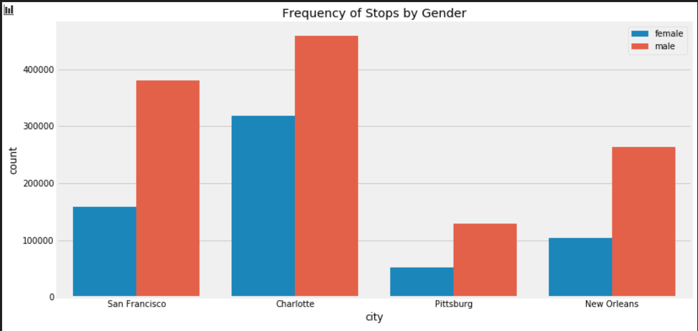
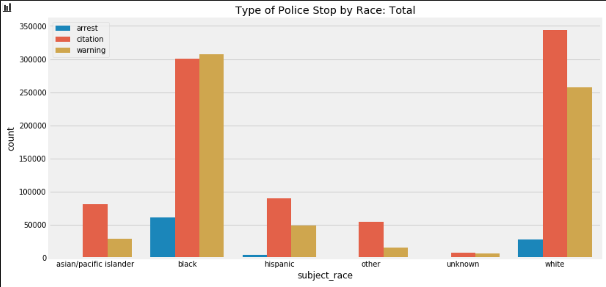

# Title: Digital Humanities 101 - Final Submission, Rishabh Parekh

## Table of Content

1. Group Project: Examining Societal biases in the Humanities. 
2. Individual Project: How Race Affects Policing in Typically Conservative of Liberal States. 
3. Individual Project Prospectus 

## Note

The data files for this project are in the shared google [folder](https://drive.google.com/drive/folders/1WcjUUmUKeANOCi-pNFhESVype0_6lguO?usp=sharing)

Please download the data files in the data folder before running the notebook. The CSV files are big and Github has a max limit of 100M on the file size committed. 

## Group Project

### Abstract of Group Project

One important component of the course was a collaborative group project. Three other students, along with myself, worked on a theoretical research project - based on academic readings. 
The topic that we chose is, “Examining the Societal Biases in the Digital Humanities.” In this project, we examined the following readings: 

- Making a Case for the Black Digital Humanities
- Why I dig Feminist Approaches to Text Analysis
- Critical Questions for Big Data
- Nan Z. Da’s The Digital Humanities Debacle

Today, data is considered to be the new oil. It is related to every aspect of business and academic decision making. With such a heavy reliance on making data-informed decisions, it is important to ensure diverse topics and perspectives are considered when performing data analysis and research. \
The papers above mentioned, serve as the theoretical framework for this project. These papers highlight the absence of diversity in research topics, the increase in issues regarding the use of computational tools in the humanities, and the importance of diverse demographics in the digital humanities.  \
In Critical Questions for Big Data, Boyd and Crawford discuss the common terms of reference as a guide for digital humanities researchers to agree on. They indicate that access to big data research is exclusive to white male researchers with strong technical competencies. In Feminist Approaches to Text Analysis, Rhody argues that Digital Humanities does not have a strong feminist methodology. In Making a Case for the Black Digital Humanities, Gallon calls for an increased racial diversity in the Digital Humanities. Lastly, in the Digital Humanities Debacle, Nan Z Da argues that there are fundamental problems that need to be addressed in the digital humanities and computational literary studies.

### Reflection on Collaborative Process

The process of collaborating in a group (virtually) on a theoretical research paper was challenging yet simultaneously rewarding. My group and I set aside time to meet on Zoom calls to prepare our presentation. We worked both individually and mostly revised the project together. Luckily, we did not face many communication issues or large time differences - as I was the only one in a different time zone. We all selected the articles together and discussed them together. At first, we were having difficulty narrowing down our project idea. Our first ideas were about the differences in humanities and STEM degrees and how their skill sets relate to the job market. For this, we would be analyzing LinkedIn job posts to see whether the skills required for each post is gained through a humanities or STEM degree. The main argument of this idea was that there is much overlap between humanities and STEM degrees and more companies spend recruiting practices dedicated to acquiring STEM talent, when the skillsets of their posting match directly with the skills of humanities majors. We realized that while we were passionate about this idea, it would be difficult to create a theoretical framework for this topic, based on the chosen articles. Instead, we decided to pivot to examining societal biases in the Digital Humanities. I feel that I grew as a student researcher in my ability to work on a research project remotely, explore unknown topics, and verbalize my ideas through my groups presentation. I had to be cognizant of using less text on the group presentation slides, rather, use visuals to express my thoughts.      

## Individual Project

### Abstract of the Individual Project

Currently, movements such as the Black Lives Matter or #DefundthePolice are bringing much needed energy and criticism towards the relationship between law enforcement and the American public. The tragic deaths of George Floyd, Breanna Taylor, and thousands of others has sparked public outrage and a demand for justice. As a UC Berkeley student, I was inspired by these movements and I feel that it is incredibly important to use data to highlight the impact of policing in different regions accessing the United States. Therefore, for my individual project, I chose to investigate whether minorities/people of color are subject to harsher and more frequent policing stops in major cities, in typically conservative states or liberal states. To clarify, the terms conservative or liberal are related to their state's political ideologies. Using data from the Stanford Open Policing Project, I analyzed the police stops in four major American cities: New Orleans, Pittsburgh, Charlotte, and San Francisco. The crux of this project is to understand whether there is a strong correlation between policing, regional political ideology, and victim race and gender.

I expected to find a strong correlation between increased policing and racial profiling in conservative regions, compared to liberal regions. I am assuming that political ideology is related to increased police brutality. Additionally, I am assuming that data from the largest cities in a state, is representative of the entire state - which may not be accurate. 

### Research Question

The research topic that I chose to investigate is: 

Are minorities/people of color subject to harsher and more frequent policing stops in major cities, in typically
conservative states or liberal states?

#### Relevance

To clarify, the terms conservative or liberal are related to their state's political ideologies. This topic is extremely relevant to our daily lives. Currently, there are protests and calls for action across the world, regarding the deaths of George Floyd, Breonna Taylor and countless others who have lost their lives due to unjust policing and racism. Slogans such as #Defundthepolice, have been trending on popular social media platforms like Twitter and Instagram. These social movements have largely been the focus of the media, therefore, with the upcoming Presidential election, it is incredibly vital for the public to have access to the data and stories of policing in their community. 

There has been significant work in highlighting the lapses in criminal justice and policing through data. Efforts from universities such as The Stanford Open Policing Project, organizations such as Police Scorecard, and newspapers such as the Washington Post, routinely publish informative pieces that address whether “there’s overwhelming evidence that the criminal justice system is racist.” These contributions are extremely positive and benefits the collective good by providing continual support to solve police brutality related issues. However, my research project is slightly different, as I am focused on investigating the relationships between policing in politically leaning liberal and conservative regions. The crux of this project is to understand whether there is a strong correlation between policing, regional political ideology, and victim race. 

### Assumptions

One assumption it that the state's political ideology is representative of the political ideology of the major city's police force. The funding of the police is decided by the state government and is therefore influenced by the state's political ideology. Typically, more convervative states tend to spend more on their police force. 

### Materials & Methods

I used multiple datasets from the Stanford Open Policing Project (https://openpolicing.stanford.edu/data/). This website provides the authentic and unprocessed datasets for crime in cities across the United States. The 4 cities that I have chosen for this project are located in states with varying political ideologies. The cities are San Francisco, Pittsburgh, Charlotte, and New Orleans. These locations were chosen because the information provided was the most complete compared to other cities listed on the website. Data contained in these csv files include the crime’s reason for the stop, its location, time, latitude, and longitude data. In addition to this, entries are also added if a citation/warning/search/arrests were made as well as the formal outcome of the reported crime (ie. if the crime ended in a citation or a warning). The subjects’ race, age, and sex are also included within the sets, which are also interesting variables to analyze across these cities for their social and political implications. I built visualizations mapping crimes in these various cities, locations, types of crime bar charts, victim race type pie charts, Twitter sentiment analysis of recent #policebrutality and #BLM activities on Jupyter, Visual Studio Code, and Twitter Developer API’s. The data is cleaned and available on CSV formats on the Stanford Open Policing Project website. In addition, I will refer to the README https://github.com/stanford-policylab/opp/blob/master/data_readme.md to understand column name meanings and extra nomenclature.

### Analysis

### Conclusion

Through this project, I hope to challenge myself as a digital humanities researcher and python programmer. I hope that the findings and visualizations from my project enables viewers to easily digest the complicated relationships of policing data, subject age, subject race, location, time of stop, and punishment. Eventually, I hope this project serves as the genesis for my end goal of developing data science tools that democratize the access to data and the public. I am committed to expanding/broadening my initial project to make more projects at the intersection of data science and public policy - intended for public good. 

In the future, I hope to take this project further by adding a sentiment analysis based on tweets from the chosen cities. 

### References

- Stanford Open Policing Project (https://openpolicing.stanford.edu/data/)

## Individual Project Prospectus

Submitted on June 22nd. 

###  Abstract
In the United States, no two cities are alike. No two states are alike. Every community has a unique political and social outlook. Individuals view their ‘version’ of the United States through their personal experiences and morals. The terms ‘conservative’ and ‘liberal’ have been misused by mass media to easily split people into two staunchly different groups- despite the fact that one’s viewpoints could lie all over the conservative/liberal spectrum. Regardless, whether one identifies as a conservative or liberal, it is evident that the United States policing problem is a bipartisan issue. According to an August 2019 study by the National Academy of Sciences, “black men were about 2.5 times more likely than white men to be killed by police, and that black men have a 1-in-1,000 chance of dying at the hands of police.” This statistic is one of thousands that indicate how broken America’s criminal justice system truly is. As a UC Berkeley undergraduate student, I was inspired by the work of the Black Lives Movement and The Bail Project, in addition to the recent revolutionary protests. As an immigrant and a minority myself, I was curious to know whether policing behavior changed towards different races, ethnicities, and ages in different political regions in the United States.  

### Complete Prospectus

Link to the [Prospectus](./prospectus.md)
